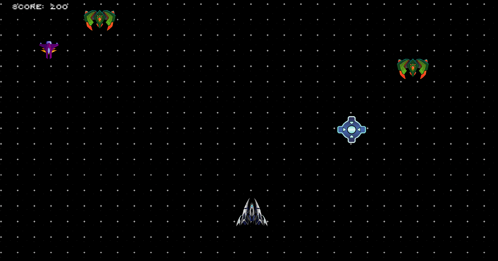

# 2D Shooter Game with SFML

This project is a 2D shooter game developed using SFML in C++. The player controls a spaceship that must survive and eliminate waves of enemies while dodging bullets and collecting power-ups to enhance performance.

## Controls
- **Movement:** Arrow keys or WASD  
- **Shooting:** Spacebar  
- **Start Game:** Enter  
- **Restart after Game Over:** R  

## Main Technical Challenges

### 1. Enemy Management with Different Behaviors  
A system was implemented to randomly generate three types of enemies, each with a 33% probability. To achieve this:  
- An `enemyType` field was added to differentiate between:  
  1. **Simple Enemy:** Moves horizontally and shoots periodically.  
  2. **Static Enemy:** Does not move, only shoots.  
  3. **Teleporting Enemy:** Remains stationary but changes position randomly over time.  

### 2. Memory Management and Object Reuse  
To optimize enemy and bullet handling, **object pools** were implemented using `ObjectPool<T>`. This prevents constant creation and destruction of enemies, improving performance.

### 3. Wave System and Progressive Difficulty  
Each time all enemies are eliminated, the game:  
- Increases the number of enemies in the next wave.  
- Boosts enemy speed after a certain number of waves.  
- Has a probability of spawning power-ups after clearing a wave.  

## GAME IMAGE

